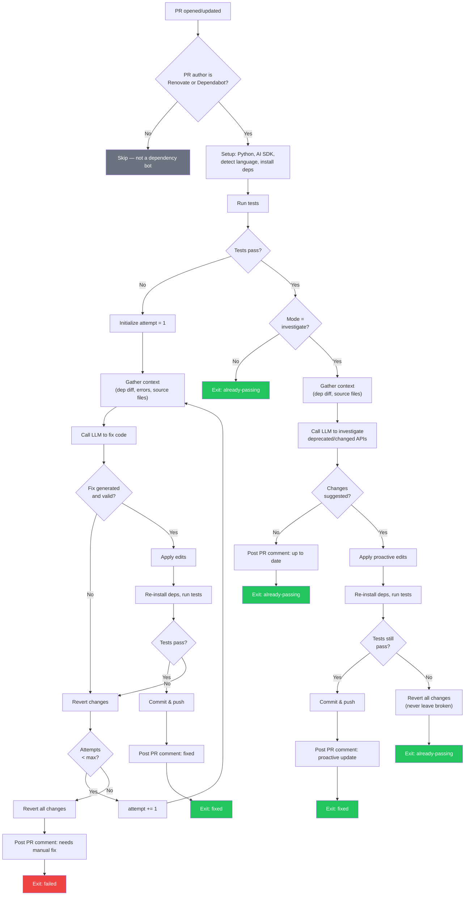

# AI Dependency Fixer

A reusable GitHub Action that automatically fixes breaking changes from dependency update PRs and proactively updates code to use current APIs — using AI.

Supports **Anthropic (Claude)**, **OpenAI (GPT)**, and **self-hosted LLMs** via any OpenAI-compatible API (Ollama, vLLM, llama.cpp, LiteLLM, etc.).

## How It Works

### Two Modes

| Mode | When tests fail | When tests pass |
|------|----------------|-----------------|
| **`investigate`** (default) | Fixes the code to make tests pass | Proactively reviews changes and updates deprecated/changed APIs |
| **`fix`** | Fixes the code to make tests pass | Exits immediately — no changes |

### Flow

```
Renovate opens PR → Run tests → Tests fail? → AI fixes code → Tests pass → Commit
                                Tests pass? → AI investigates changes → Updates code → Verify tests still pass → Commit
```

1. Triggers on PRs from Renovate or Dependabot
2. Runs your test suite
3. **If tests fail** — gathers context (dependency diff, errors, source files), sends to the LLM, applies the fix, verifies tests pass, retries up to N times
4. **If tests pass (investigate mode)** — still analyzes the dependency changes, looks for deprecated APIs or outdated patterns, applies proactive updates, then **verifies tests still pass** before committing
5. If proactive changes break tests, they are **automatically reverted** — the code is never left in a broken state
6. All changes are committed to the PR branch for human review before merge

### Flow Diagram



## Safety Guardrails

- Will NOT delete or skip tests
- Will NOT remove existing code, functions, classes, or methods
- Will NOT change public API contracts (function signatures, return types, external behavior)
- Will NOT modify lockfiles or dependency manifests
- Will NOT add new dependencies
- Rejects edits that significantly reduce code size (detects code deletion)
- Rejects AI edits larger than a configurable line limit
- In investigate mode, **automatically reverts** proactive changes if tests break
- Reverts all changes if unable to fix after max attempts
- All changes are committed to the PR branch for human review before merge

## Supported Languages

Auto-detects language and test commands for:

| Language | Test Command | Install Command |
|----------|-------------|-----------------|
| Node.js (npm/yarn/pnpm) | `npm test` / `yarn test` / `pnpm test` | `npm ci` / `yarn install` / `pnpm install` |
| Python (pytest) | `pytest` | `pip install` / `poetry install` |
| Go | `go test ./...` | `go mod download` |
| Rust | `cargo test` | `cargo fetch` |
| Java (Maven) | `mvn test -B` | `mvn dependency:resolve` |
| Java (Gradle) | `./gradlew test` | `./gradlew dependencies` |
| Ruby | `bundle exec rake test` | `bundle install` |

Override with `test-command` and `install-command` inputs if needed.

## Quick Start

### Using Anthropic (Claude) — default

1. Add `ANTHROPIC_API_KEY` to **Settings → Secrets → Actions**
2. Create `.github/workflows/ai-dependency-fix.yml`:

```yaml
name: AI Dependency Fix

on:
  pull_request:
    types: [opened, synchronize]

jobs:
  ai-fix:
    if: >
      github.actor == 'renovate[bot]' ||
      github.actor == 'dependabot[bot]'
    runs-on: ubuntu-latest
    permissions:
      contents: write
      pull-requests: write
    steps:
      - uses: actions/checkout@v4
        with:
          ref: ${{ github.head_ref }}
          fetch-depth: 0
          token: ${{ secrets.GITHUB_TOKEN }}

      - uses: your-org/ai-dependency-fixer@v1
        with:
          ai-api-key: ${{ secrets.ANTHROPIC_API_KEY }}
          # mode: investigate  # default — also proactively updates passing code
          # mode: fix          # only fix failing tests
```

### Using OpenAI (GPT)

```yaml
      - uses: your-org/ai-dependency-fixer@v1
        with:
          ai-provider: openai
          ai-api-key: ${{ secrets.OPENAI_API_KEY }}
          # ai-model: gpt-4o  # default; or use gpt-4-turbo, etc.
```

### Using a self-hosted LLM (Ollama, vLLM, etc.)

Any server that exposes an OpenAI-compatible `/v1/chat/completions` endpoint works.

```yaml
      - uses: your-org/ai-dependency-fixer@v1
        with:
          ai-provider: openai-compatible
          ai-api-key: 'not-needed'          # or a real key if your server requires one
          ai-base-url: 'http://localhost:11434/v1'  # Ollama example
          ai-model: 'llama3'
```

## Inputs

| Input | Required | Default | Description |
|-------|----------|---------|-------------|
| `ai-api-key` | Yes | - | API key for the chosen provider |
| `ai-provider` | No | `anthropic` | Provider: `anthropic`, `openai`, or `openai-compatible` |
| `ai-base-url` | No | - | Base URL for self-hosted models (only with `openai-compatible`) |
| `mode` | No | `investigate` | `investigate` (proactive + reactive) or `fix` (reactive only) |
| `max-attempts` | No | `3` | Max fix attempts before giving up |
| `test-command` | No | `auto` | Test command (`auto` for detection) |
| `install-command` | No | `auto` | Install command (`auto` for detection) |
| `max-diff-lines` | No | `200` | Max lines in AI edit (safety limit) |
| `ai-model` | No | *(per-provider)* | Model name (defaults: `claude-sonnet-4-20250514` for Anthropic, `gpt-4o` for OpenAI) |
| `github-token` | No | `${{ github.token }}` | Token for PR comments |

## Outputs

| Output | Description |
|--------|-------------|
| `result` | `fixed`, `already-passing`, or `failed` |
| `attempts` | Number of fix attempts made |

## Self-Hosted LLM Examples

<details>
<summary><strong>Ollama</strong></summary>

Start Ollama with a model, then point the action at it:

```yaml
      - uses: your-org/ai-dependency-fixer@v1
        with:
          ai-provider: openai-compatible
          ai-api-key: 'not-needed'
          ai-base-url: 'http://localhost:11434/v1'
          ai-model: 'llama3'
```

</details>

<details>
<summary><strong>vLLM</strong></summary>

```yaml
      - uses: your-org/ai-dependency-fixer@v1
        with:
          ai-provider: openai-compatible
          ai-api-key: 'not-needed'
          ai-base-url: 'http://localhost:8000/v1'
          ai-model: 'meta-llama/Llama-3-70b-chat-hf'
```

</details>

<details>
<summary><strong>LiteLLM proxy</strong></summary>

LiteLLM can proxy requests to any provider through a single OpenAI-compatible endpoint:

```yaml
      - uses: your-org/ai-dependency-fixer@v1
        with:
          ai-provider: openai-compatible
          ai-api-key: ${{ secrets.LITELLM_API_KEY }}
          ai-base-url: 'http://localhost:4000/v1'
          ai-model: 'gpt-4o'
```

</details>

## Cost

Typical cost per dependency PR varies by provider:

| Provider | Estimated cost per PR |
|----------|----------------------|
| Anthropic (Claude) | $0.05 – $0.15 |
| OpenAI (GPT-4o) | $0.05 – $0.20 |
| Self-hosted | Infrastructure cost only |

## Privacy & Data

This action sends the following data to the configured LLM provider to generate fixes:

- **Dependency diff** — changes to lockfiles and manifests
- **Test failure output** — stderr/stdout from your test runner
- **Source file snippets** — files that import the updated dependency (up to ~50KB)
- **PR metadata** — title, description, and branch name

No API keys, secrets, or credentials are included in the LLM request. If your organization has policies about sending source code to third-party APIs, consider using the `openai-compatible` provider with a **self-hosted model** to keep all data on your own infrastructure.

## License

Apache-2.0
