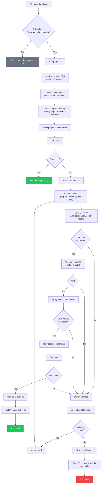

# AI Dependency Fixer

A reusable GitHub Action that automatically fixes breaking changes from dependency update PRs (Renovate, Dependabot, etc.) using AI.

Supports **Anthropic (Claude)**, **OpenAI (GPT)**, and **self-hosted LLMs** via any OpenAI-compatible API (Ollama, vLLM, llama.cpp, LiteLLM, etc.).

## How It Works

```
Renovate opens PR → Tests fail → AI analyzes errors → Generates fix → Tests pass → Commits fix
```

1. Triggers on PRs from Renovate or Dependabot
2. Runs your test suite to check if the update breaks anything
3. If tests fail, gathers context (dependency diff, error output, relevant source files)
4. Sends context to the configured LLM to generate targeted code fixes
5. Applies the fix and re-runs tests
6. Retries up to N times with accumulated context from previous attempts
7. If tests pass, commits and pushes the fix to the PR branch
8. If all attempts fail, reverts changes and posts a comment explaining what was tried

### Flow Diagram



## Safety Guardrails

- Will NOT delete or skip tests
- Will NOT remove existing functionality
- Will NOT modify lockfiles or dependency manifests
- Will NOT add new dependencies
- Rejects AI edits larger than a configurable line limit
- Reverts all changes if unable to fix after max attempts
- All fixes are committed to the PR branch for human review before merge

## Supported Languages

Auto-detects language and test commands for:

| Language | Test Command | Install Command |
|----------|-------------|-----------------|
| Node.js (npm/yarn/pnpm) | `npm test` / `yarn test` / `pnpm test` | `npm ci` / `yarn install` / `pnpm install` |
| Python (pytest) | `pytest` | `pip install` / `poetry install` |
| Go | `go test ./...` | `go mod download` |
| Rust | `cargo test` | `cargo fetch` |
| Java (Maven) | `mvn test -B` | `mvn dependency:resolve` |
| Java (Gradle) | `./gradlew test` | `./gradlew dependencies` |
| Ruby | `bundle exec rake test` | `bundle install` |

Override with `test-command` and `install-command` inputs if needed.

## Quick Start

### Using Anthropic (Claude) — default

1. Add `ANTHROPIC_API_KEY` to **Settings → Secrets → Actions**
2. Create `.github/workflows/ai-dependency-fix.yml`:

```yaml
name: AI Dependency Fix

on:
  pull_request:
    types: [opened, synchronize]

jobs:
  ai-fix:
    if: >
      github.actor == 'renovate[bot]' ||
      github.actor == 'dependabot[bot]'
    runs-on: ubuntu-latest
    permissions:
      contents: write
      pull-requests: write
    steps:
      - uses: actions/checkout@v4
        with:
          ref: ${{ github.head_ref }}
          fetch-depth: 0
          token: ${{ secrets.GITHUB_TOKEN }}

      - uses: your-org/ai-dependency-fixer@v1
        with:
          ai-api-key: ${{ secrets.ANTHROPIC_API_KEY }}
```

### Using OpenAI (GPT)

```yaml
      - uses: your-org/ai-dependency-fixer@v1
        with:
          ai-provider: openai
          ai-api-key: ${{ secrets.OPENAI_API_KEY }}
          # ai-model: gpt-4o  # default; or use gpt-4-turbo, etc.
```

### Using a self-hosted LLM (Ollama, vLLM, etc.)

Any server that exposes an OpenAI-compatible `/v1/chat/completions` endpoint works.

```yaml
      - uses: your-org/ai-dependency-fixer@v1
        with:
          ai-provider: openai-compatible
          ai-api-key: 'not-needed'          # or a real key if your server requires one
          ai-base-url: 'http://localhost:11434/v1'  # Ollama example
          ai-model: 'llama3'
```

## Inputs

| Input | Required | Default | Description |
|-------|----------|---------|-------------|
| `ai-api-key` | Yes | - | API key for the chosen provider |
| `ai-provider` | No | `anthropic` | Provider: `anthropic`, `openai`, or `openai-compatible` |
| `ai-base-url` | No | - | Base URL for self-hosted models (only with `openai-compatible`) |
| `max-attempts` | No | `3` | Max fix attempts before giving up |
| `test-command` | No | `auto` | Test command (`auto` for detection) |
| `install-command` | No | `auto` | Install command (`auto` for detection) |
| `max-diff-lines` | No | `200` | Max lines in AI edit (safety limit) |
| `ai-model` | No | *(per-provider)* | Model name (defaults: `claude-sonnet-4-20250514` for Anthropic, `gpt-4o` for OpenAI) |
| `github-token` | No | `${{ github.token }}` | Token for PR comments |

## Outputs

| Output | Description |
|--------|-------------|
| `result` | `fixed`, `already-passing`, or `failed` |
| `attempts` | Number of fix attempts made |

## Self-Hosted LLM Examples

<details>
<summary><strong>Ollama</strong></summary>

Start Ollama with a model, then point the action at it:

```yaml
      - uses: your-org/ai-dependency-fixer@v1
        with:
          ai-provider: openai-compatible
          ai-api-key: 'not-needed'
          ai-base-url: 'http://localhost:11434/v1'
          ai-model: 'llama3'
```

</details>

<details>
<summary><strong>vLLM</strong></summary>

```yaml
      - uses: your-org/ai-dependency-fixer@v1
        with:
          ai-provider: openai-compatible
          ai-api-key: 'not-needed'
          ai-base-url: 'http://localhost:8000/v1'
          ai-model: 'meta-llama/Llama-3-70b-chat-hf'
```

</details>

<details>
<summary><strong>LiteLLM proxy</strong></summary>

LiteLLM can proxy requests to any provider through a single OpenAI-compatible endpoint:

```yaml
      - uses: your-org/ai-dependency-fixer@v1
        with:
          ai-provider: openai-compatible
          ai-api-key: ${{ secrets.LITELLM_API_KEY }}
          ai-base-url: 'http://localhost:4000/v1'
          ai-model: 'gpt-4o'
```

</details>

## Cost

Typical cost per dependency PR varies by provider:

| Provider | Estimated cost per PR |
|----------|----------------------|
| Anthropic (Claude) | $0.05 – $0.15 |
| OpenAI (GPT-4o) | $0.05 – $0.20 |
| Self-hosted | Infrastructure cost only |

## License

Apache-2.0
