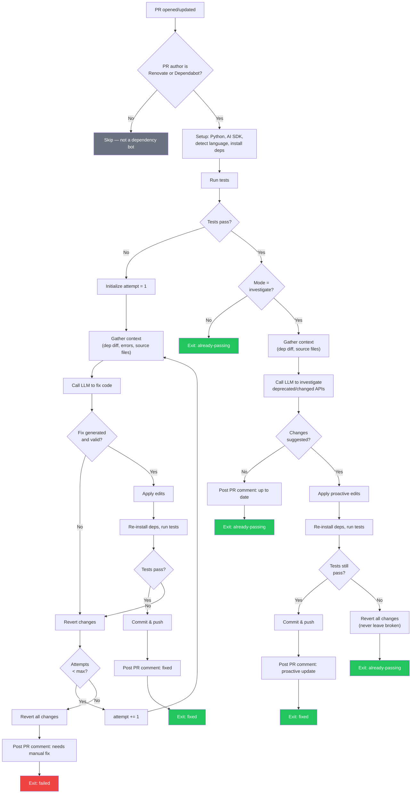

# AI Dependency Fixer — Logic Flow

```mermaid
flowchart TD
    A["PR opened/updated"] --> B{"PR author is\nRenovate or Dependabot?"}
    B -- No --> Z["Skip — not a dependency bot"]
    B -- Yes --> C["Setup: Python, AI SDK,\ndetect language, install deps"]
    C --> H["Run tests"]

    H --> I{"Tests pass?"}

    I -- No --> K["Initialize attempt = 1"]
    K --> L["Gather context\n(dep diff, errors, source files)"]
    L --> M["Call LLM to fix code"]
    M --> N{"Fix generated\nand valid?"}
    N -- No --> R["Revert changes"]
    N -- Yes --> Q["Apply edits"]
    Q --> T["Re-install deps, run tests"]
    T --> V{"Tests pass?"}
    V -- Yes --> W["Commit & push"]
    W --> X["Post PR comment: fixed"]
    X --> Y["Exit: fixed"]
    V -- No --> R
    R --> AB{"Attempts\n< max?"}
    AB -- Yes --> AC["attempt += 1"] --> L
    AB -- No --> AD["Revert all changes"]
    AD --> AE["Post PR comment: needs manual fix"]
    AE --> AF["Exit: failed"]

    I -- Yes --> INV{"Mode =\ninvestigate?"}
    INV -- No --> J["Exit: already-passing"]
    INV -- Yes --> IG["Gather context\n(dep diff, source files)"]
    IG --> IM["Call LLM to investigate\ndeprecated/changed APIs"]
    IM --> IC{"Changes\nsuggested?"}
    IC -- No --> IU["Post PR comment: up to date"]
    IU --> J2["Exit: already-passing"]
    IC -- Yes --> IA["Apply proactive edits"]
    IA --> IT["Re-install deps, run tests"]
    IT --> IV{"Tests still\npass?"}
    IV -- Yes --> IW["Commit & push"]
    IW --> IX["Post PR comment: proactive update"]
    IX --> IY["Exit: fixed"]
    IV -- No --> IR["Revert all changes\n(never leave broken)"]
    IR --> J3["Exit: already-passing"]

    style J fill:#22c55e,color:#fff
    style J2 fill:#22c55e,color:#fff
    style J3 fill:#22c55e,color:#fff
    style Y fill:#22c55e,color:#fff
    style IY fill:#22c55e,color:#fff
    style AF fill:#ef4444,color:#fff
    style Z fill:#6b7280,color:#fff
```
